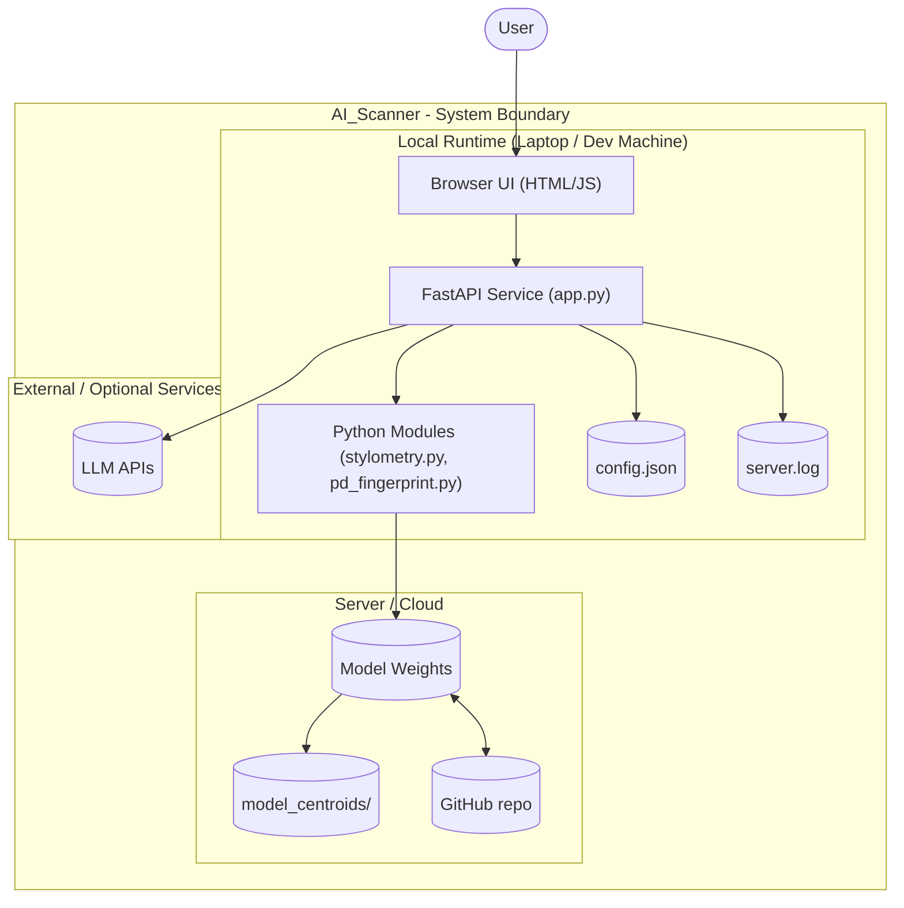

# CopyCat / AI_Scanner — System Architecture Overview (v0.3.3)

## Boundary diagram of AI_Scanner showing user interaction and how actions flow through the local client, backend runtime, external services, and data stores.

