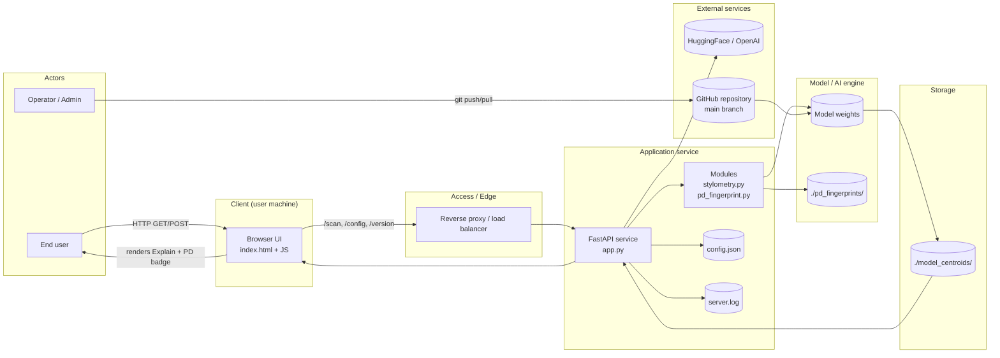

# CopyCat / AI_Scanner — System Architecture Overview (v0.3.3)

High-level relational view showing how user actions propagate through the local client, backend service, and external APIs or runtime environments.

